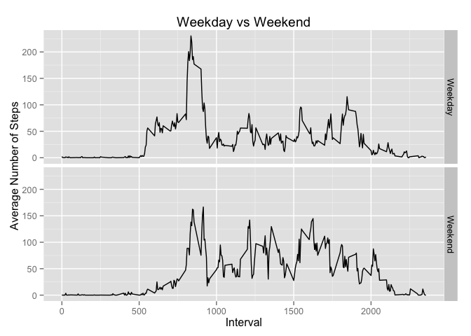

# Reproducible Research: Peer Assessment 1


## Loading and preprocessing the data

First we set the folder location and read the file into R for analysis:


```r
setwd("/Users/gio/Git Repositories/RepData_PeerAssessment1")

##installing packages we need
install.packages("chron",repos="http://cran.rstudio.com/")
```

```
## 
## The downloaded binary packages are in
## 	/var/folders/sn/d0c19jqj2zsb92ygp6yxc8m40000gn/T//RtmplR36ia/downloaded_packages
```

```r
library(chron)
install.packages("plyr",repos="http://cran.rstudio.com/")
```

```
## 
## The downloaded binary packages are in
## 	/var/folders/sn/d0c19jqj2zsb92ygp6yxc8m40000gn/T//RtmplR36ia/downloaded_packages
```

```r
library(plyr)
install.packages("ggplot2",repos="http://cran.rstudio.com/")
```

```
## 
## The downloaded binary packages are in
## 	/var/folders/sn/d0c19jqj2zsb92ygp6yxc8m40000gn/T//RtmplR36ia/downloaded_packages
```

```r
library(ggplot2)

##read data to R
actdata<-read.csv("activity.csv")
```

## What is mean total number of steps taken per day?

Analysing the data, we will make a histogram of the total number of steps taken each day, calculate and report the mean and median total number of steps taken per day.


```r
aggdata <- aggregate(steps ~ date,data=actdata,FUN=sum)
hist(aggdata$steps,main="Histogram of Total Steps Per Day",xlab="Steps")
```

 

```r
mean(aggdata$steps)
```

```
## [1] 10766.19
```

```r
median(aggdata$steps)
```

```
## [1] 10765
```

## What is the average daily activity pattern?

We make a time series plot of the 5-minute interval and the average number of steps taken, averaged across all days:


```r
by_interval<-aggregate(steps ~ interval, data=actdata, FUN=mean)
plot(by_interval$interval,by_interval$steps,type="l",main="Average Steps per 5 minute interval",xlab="Intervals",ylab="Steps")
```

 

The 5-minute interval, on average across all the days in the dataset, containing the maximum number of steps is:

```r
by_interval[which.max( by_interval[,2] ),1]
```

```
## [1] 835
```

## Imputing missing values
We then calculate and report the total number of missing values in the dataset (i.e. the total number of rows with NAs)


```r
sum(is.na(actdata[,1]))
```

```
## [1] 2304
```

We will adopt a strategy using the mean for that 5-minute interval and create a new dataset that is equal to the original dataset but with the missing data filled in.


```r
by_interval<-aggregate(steps ~ interval, data=actdata, FUN=mean) ##average the steps per interval
no_na<-actdata[!is.na(actdata$steps),] ##create dataframe containing all data with steps
all_na<-actdata[is.na(actdata$steps),] ##create dataframe containing data with NAs
all_na_trans<-merge(x = all_na, y = by_interval, by = "interval", all.x=TRUE) ##replace NAs with average steps per interval
all_na_trans<-all_na_trans[c("steps.y","date","interval")]
names(all_na_trans)<-c("steps","date","interval")
mdata<-merge(no_na,all_na_trans,all=TRUE) ##combine to produce new dataframe with NAs replaced by average steps per interval
head(mdata)
```

```
##   steps       date interval
## 1     0 2012-10-01       40
## 2     0 2012-10-01      120
## 3     0 2012-10-01      155
## 4     0 2012-10-01      200
## 5     0 2012-10-01      205
## 6     0 2012-10-01      215
```

```r
tail(mdata)
```

```
##       steps       date interval
## 17563   785 2012-11-24     1600
## 17564   786 2012-10-15      835
## 17565   789 2012-11-19      720
## 17566   794 2012-11-27      550
## 17567   802 2012-10-12      900
## 17568   806 2012-11-27      615
```

Then we make a histogram of the total number of steps taken each day, calculate and report the mean and median total number of steps taken per day.

```r
aggdata2 <- aggregate(steps ~ date,data=mdata,FUN=sum)
hist(aggdata2$steps,main="Histogram of Total Steps Per Day",xlab="Steps")
```

 

```r
mean(aggdata2$steps)
```

```
## [1] 10766.19
```

```r
median(aggdata2$steps)
```

```
## [1] 10766.19
```

The total number of steps have increased although we find minor differences in the mean and median.

## Are there differences in activity patterns between weekdays and weekends?

First we create a new factor variable in the dataset with two levels -- "weekday" and "weekend" indicating whether a given date is a weekday or weekend day.


```r
mdata["leweekend"]<-sapply(as.character(mdata$date),function(x) ifelse(is.weekend(x),"Weekend","Weekday"))
head(mdata)
```

```
##   steps       date interval leweekend
## 1     0 2012-10-01       40   Weekday
## 2     0 2012-10-01      120   Weekday
## 3     0 2012-10-01      155   Weekday
## 4     0 2012-10-01      200   Weekday
## 5     0 2012-10-01      205   Weekday
## 6     0 2012-10-01      215   Weekday
```

Then we plot the data on a time series plot of the 5-minute interval (x-axis) and the average number of steps taken, averaged across all weekday days or weekend days (y-axis).

```r
mdata_summarized<-ddply(mdata,c("leweekend","interval"),summarize,ave.steps=mean(steps))
qplot(x=interval,y=ave.steps, data=mdata_summarized, geom="line", facets=leweekend~.,main="Weekday vs Weekend",ylab="Average Number of Steps",xlab="Interval")
```

 
